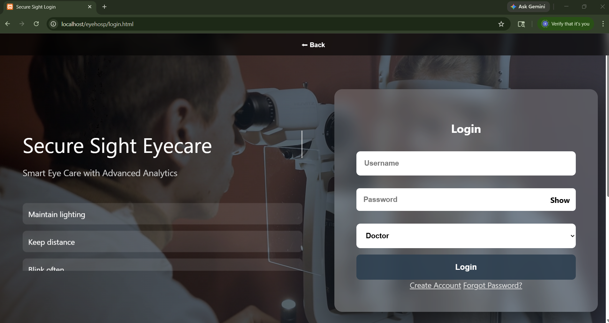
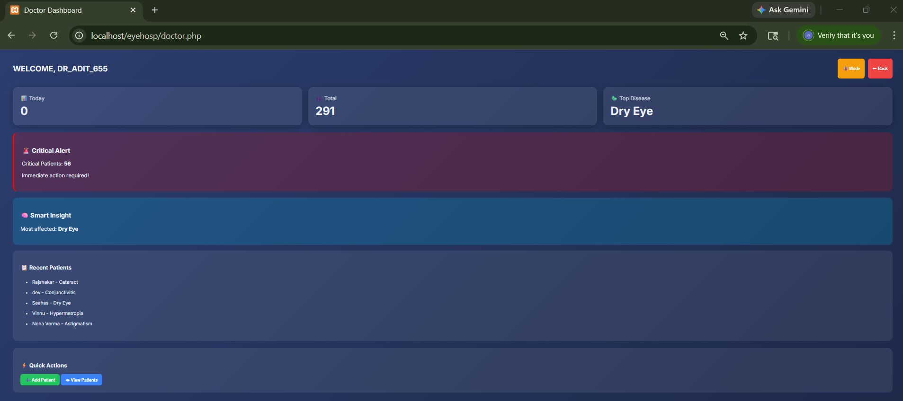
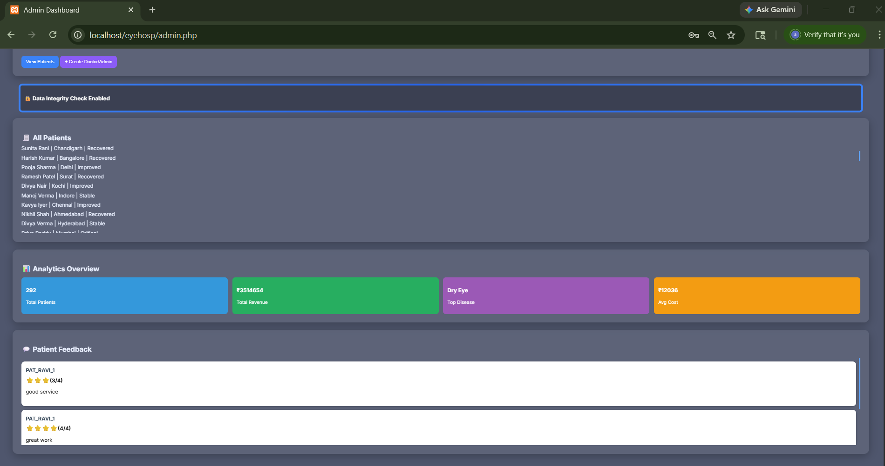
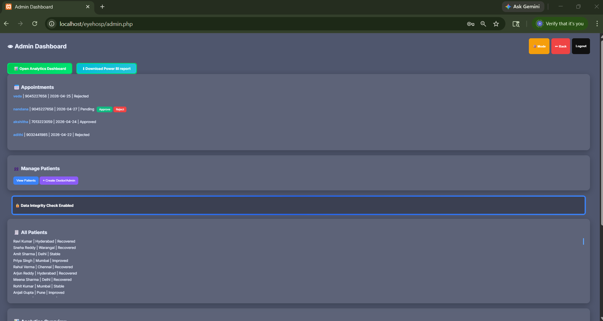
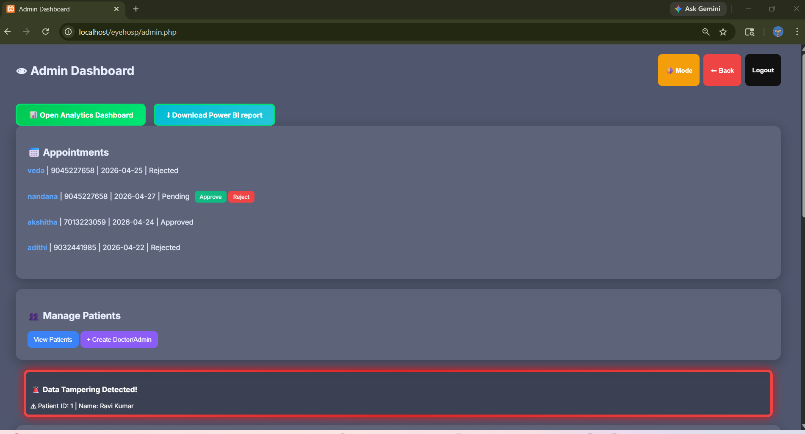
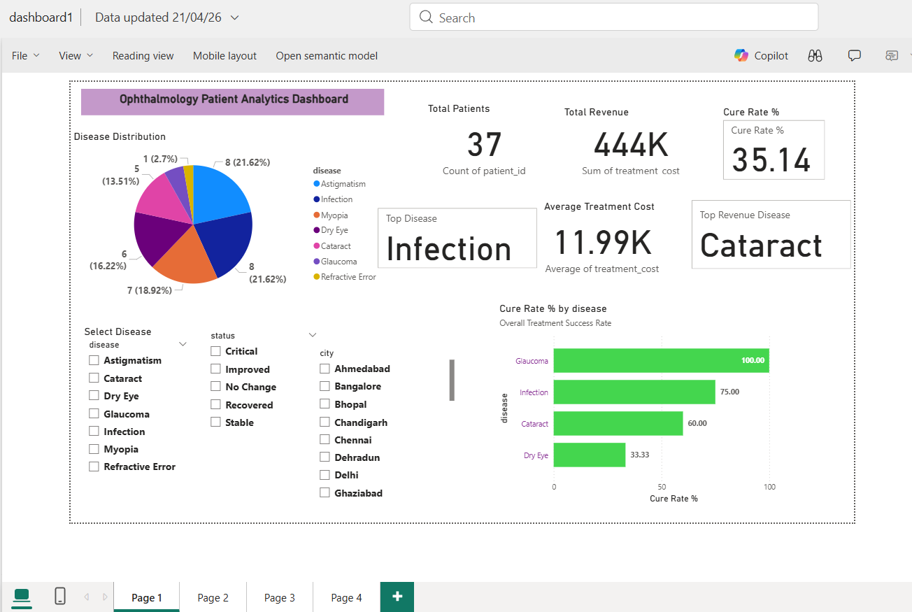
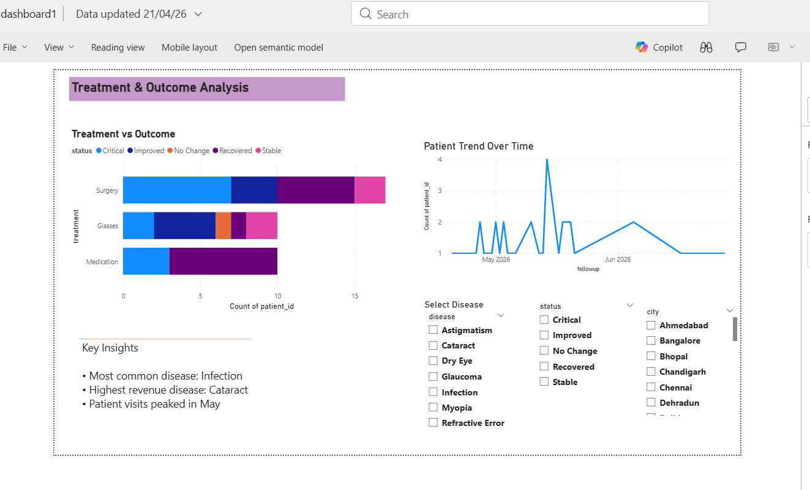
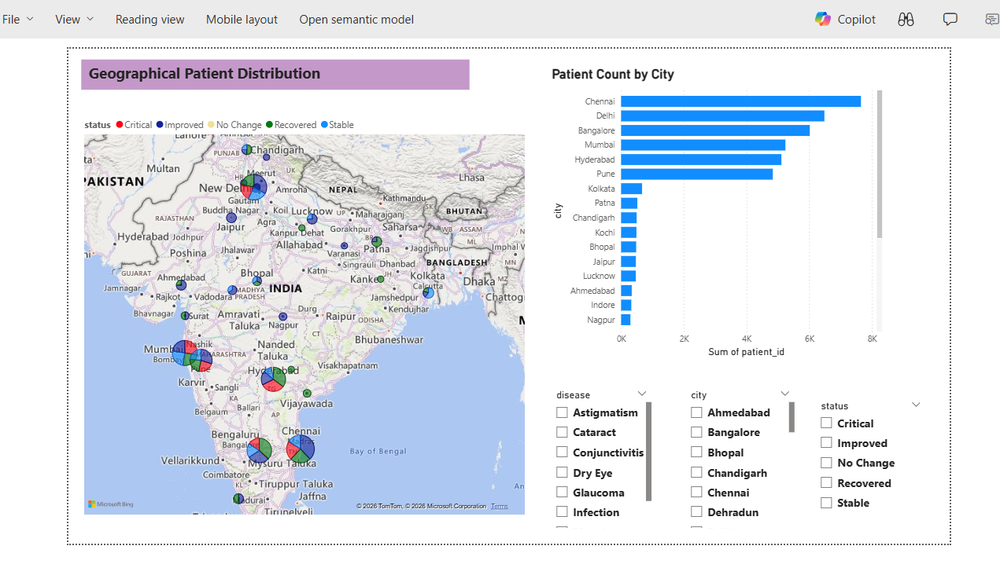

# Blockchain-Enabled Eye Hospital Data Management & Analytics System
A full-stack healthcare management system for secure patient record handling, blockchain integrity verification, and analytics.

## Tech Stack
- PHP
- Python
- MySQL
- HTML
- CSS
- JavaScript
- Ganache (Ethereum Simulator)
- Power BI

## Features
- Role-based authentication (Admin / Doctor / Patient)
- Patient record management
- Appointment booking
- Blockchain SHA-256 integrity verification
- Tamper detection
- Analytics dashboard and reporting

## Team
Team of 3
## Screenshots

### Login Page

### Doctor Dashboard

### Admin Dashboard

### Admin Dashboard – Tamper Detection

### Tamper Detection

### Analytics Dashboard

### Treatment & Outcome Analysis

### Geographical Patient Distribution

